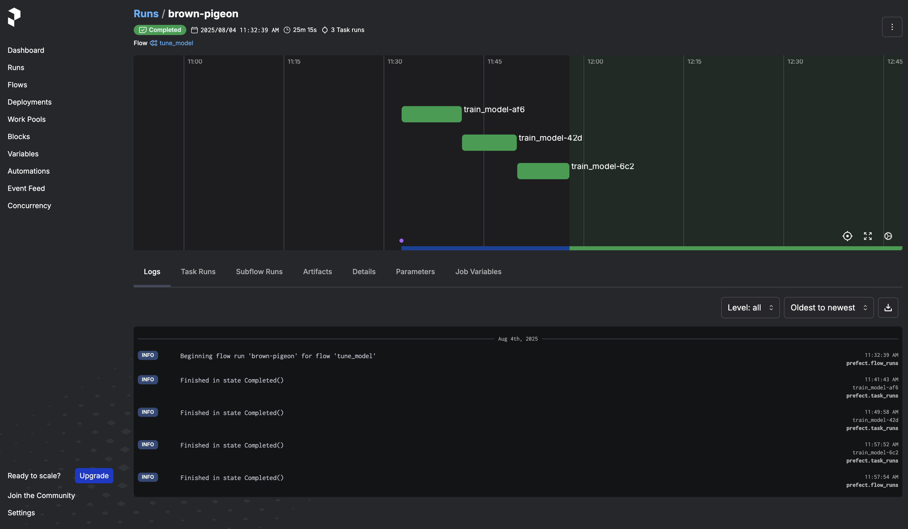
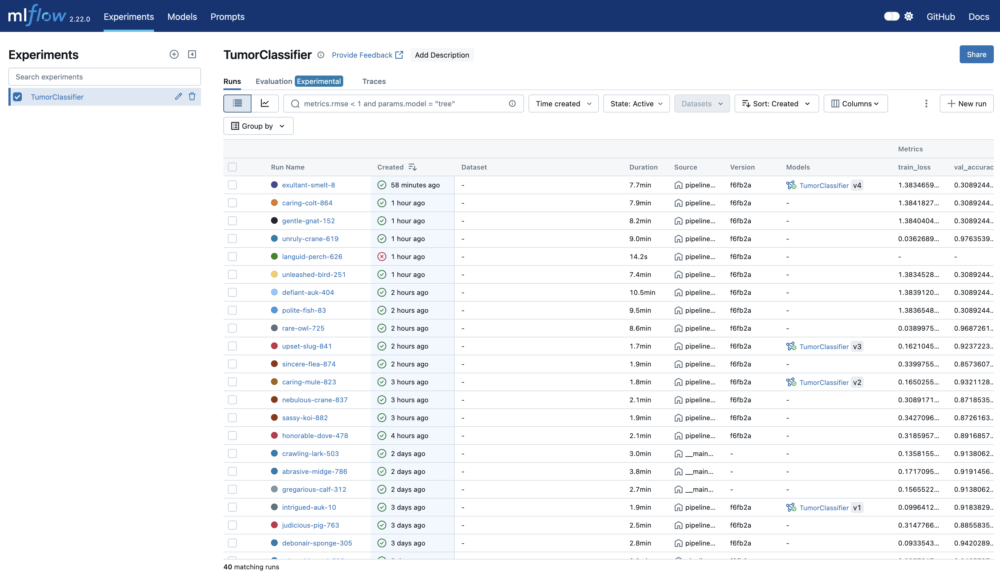
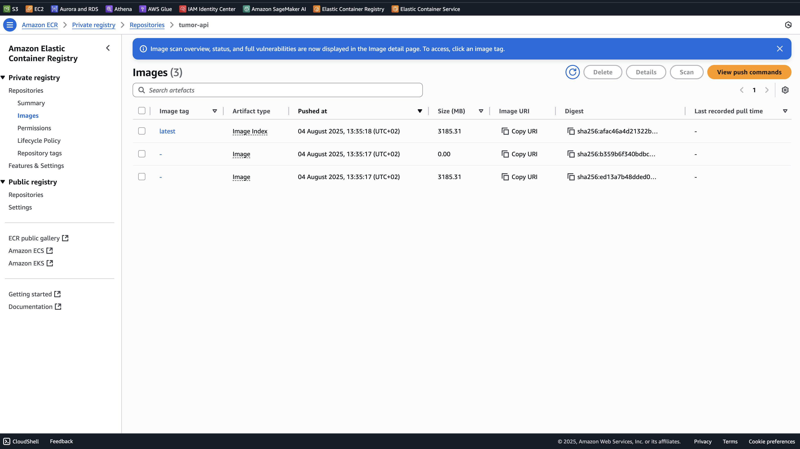
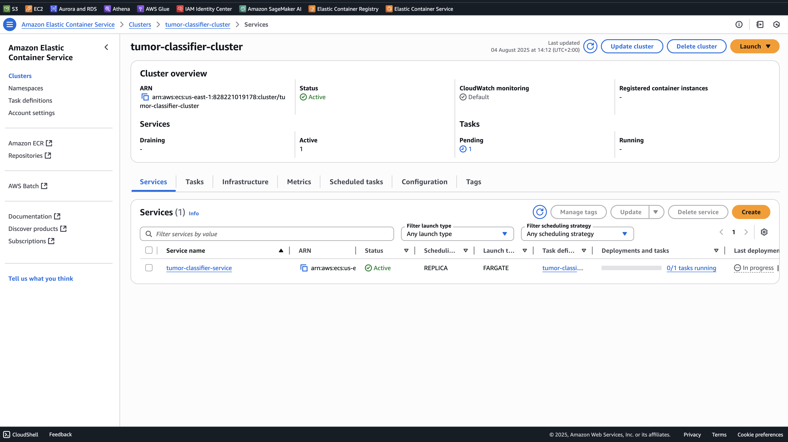

# 🧠 Brain Tumor Classification with MRI Scans
This repository contains a machine learning project for classifying brain tumors using MRI images. The model is trained to detect and categorize four types of brain conditions from axial brain scan images.

## 👤 Author
**[Daniel Egbo](https://www.linkedin.com/in/egbodaniel/)**


## 🧩 Problem Statement

Brain tumors pose a serious health challenge, requiring timely and accurate diagnosis to improve treatment outcomes. Magnetic Resonance Imaging (MRI), especially T1-weighted contrast-enhanced scans, is widely used for brain tumor detection. However, manual interpretation of MRI scans is time-consuming and can be subject to inter-observer variability.

This project aims to automate the classification of brain tumors from MRI images using a machine learning model. The objective is to accurately categorize axial brain scans into one of four classes — glioma, meningioma, pituitary tumor, or no tumor — thereby assisting radiologists in diagnosis and reducing diagnostic delays.


## 🗂️ Dataset Description

The dataset used in this project is sourced from the [Kaggle Brain Tumor MRI Dataset](https://www.kaggle.com/datasets/masoudnickparvar/brain-tumor-mri-dataset). It consists of T1-weighted contrast-enhanced MRI images captured in the axial plane. The images are grouped into four categories, each representing a distinct medical condition:

- **glioma** – a type of tumor that arises from glial cells in the brain.
- **meningioma** – typically a slow-growing tumor that forms on the meninges, the membranes covering the brain and spinal cord.
- **pituitary** – tumors originating in the pituitary gland, located at the base of the brain.
- **notumor** – MRI scans that show no evidence of tumor.

Each category is stored in a separate subdirectory, and the images are in JPEG format. The dataset is balanced and suitable for supervised image classification tasks.

## ✅ Requirements

This project is built using a modern MLOps stack and requires the following tools and libraries:

- **Python 3.10+** — Core programming language for data preprocessing, model training, and orchestration
- **torch** — Deep learning framework used to build and train the brain tumor classification model
- **torchvision** — Utilities for image transformations and loading image datasets
- **scikit-learn** — Metrics, evaluation tools, and utilities for model validation
- **MLflow** — For experiment tracking, model logging, and registry management
- **prefect** — Workflow orchestration to manage the ML pipeline as reproducible tasks and flows
- **Docker** — Containerization of the training and inference environments
- **AWS ECR (Elastic Container Registry)** — Storage for Docker images used in deployment
- **AWS ECS (Elastic Container Service)** — For deploying the trained model as a scalable web service


# 🚀 Getting Started

### 1. Clone the repository

```bash
git clone https://github.com/Danselem/brain_mri.git
cd brain_mri
```

The project makes use of `Makefile` and [Astral uv](https://docs.astral.sh/uv/). Click the Astral link to see the details of the package and how to install it.

### 2. Create and activate a virtual environment
To create and activate an environment:

```bash
make init
```

### 3. ⚙️ Install dependencies

```bash
make install
```

### 4. Fetch Data
```bash
make fetch-data
```
This will fetch the data from Kaggle and store it in the [data](data) repo. Ensure you have a Kaggle account and set up your API key.

### 5. Set up MLflow server

There are two options to set up MLflow

1. **Use AWS EC2 and S3**
Ensure terraform is installed on your PC and you have AWS credentials set up on your PC with `aws configure`. Next, `cd infra` then follow the instructions in [infra](infra/infra.md) for a complete set up of AWS resources including `EC2`, `RDS`, `S3`, `Kinesis`, `Lambda`, etc.

2. **Use DagsHub**
Sign up at [Dagshub](https://dagshub.com/) and obtain an API key and create a project repo. After that, run the command to create a `.env` file:

```bash
make env
```
Next, fill the `.env` file with the right information.


### 6. Start the orchestrator.
This project uses `Prefect` for running the ML pipeline. To start the prefect server, run the command:
```bash
make prefect
```
This will start a prefect server running at <https://127.0.0.1/4200>.

### 7 Run the ML Pipeline
To run the pipeline,
```bash
make pipeline
```
This will proceed to load the data, transform it and start the parameter tuning.  See image below for the prefect modeling pipeline

.

It will also log the ML experiments in Dagshub and also register the best model. For example, see below.
.

All experiments ran for this project can be accessed in [Dagshub](https://dagshub.com/Danselem/brain_mri/experiments).

### 8. Fetch and serve the best model
```bash
fetch-best-model
```
The above command will fetch the registered model from the Dagshub MLFlow server and save it in the [models](models) repo. With this, we are ready to serve the model.

### 9. Serve the model locally
Test the local deployment
```bash
make serve_local
```

### 10. Build the `Docker` container
```bash
make build
```

### 11. Start and run the Docker container
```bash
make run
```

### 12. Push the container to AWS ECR
```bash
make ecr
```
This uses the [ecr bash script](ecr.sh) to create and container and push to AWS ECR. Here is the sample below:




### 13. Deploy the container to AWS ECS
```bash
make ecs
```
This uses the [ecs bash script](ecs.sh) and deploy the container to AWS ECS. Here is the sample below:



## 🧪 Testing with Pytest
To test your setup or add unit tests:
```bash
make test
```


## 📊 Evaluation

- Accuracy and loss plots
- Confusion matrix

Performance metrics are saved in the MLFlow server.


## 📚 References

- Masoud Nickparvar, Brain Tumor MRI Dataset – [Kaggle Dataset](https://www.kaggle.com/datasets/masoudnickparvar/brain-tumor-mri-dataset)
- Related works on medical image classification with deep learning

## 📜 License

This project is for educational and research purposes only. Please refer to the dataset's license on Kaggle for usage terms. This project is licensed under the MIT [License](/LICENSE).

---

## 🙋🏽‍♀️ Contact

Made with 💻 by [Daniel Egbo](https://www.linkedin.com/in/egbodaniel/). Feel free to reach out with questions, issues, or suggestions.

